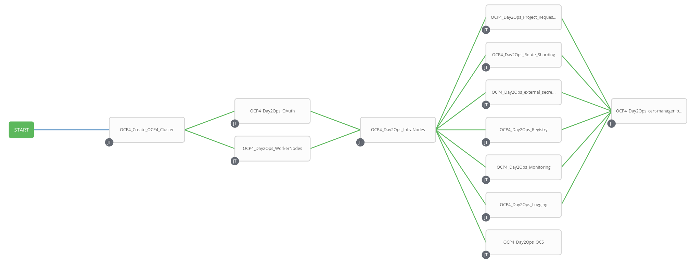
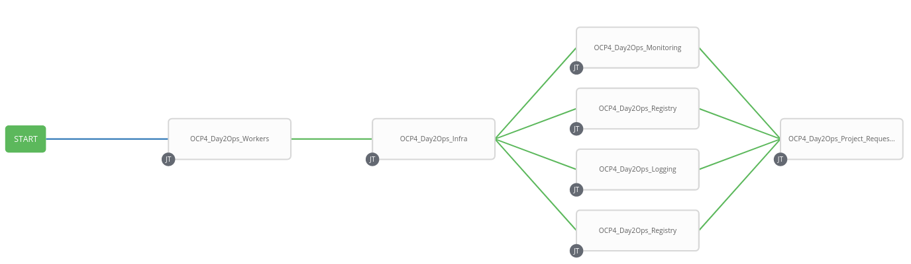
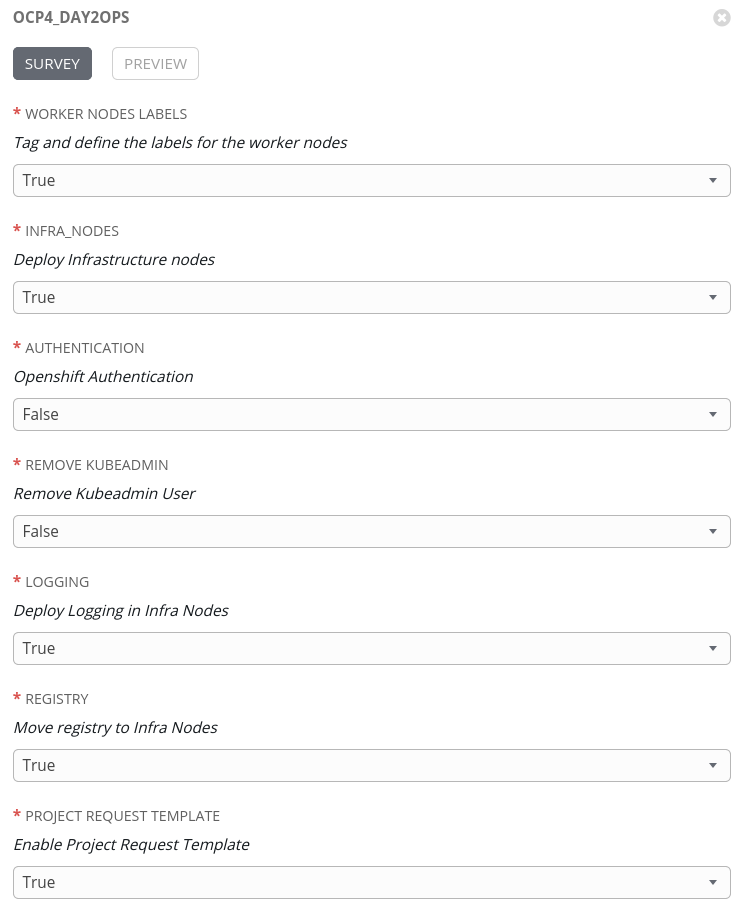
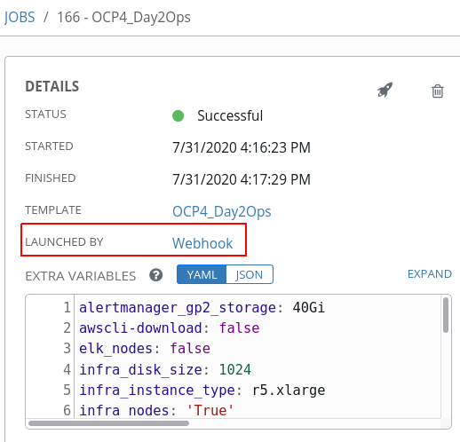

# Openshift4 Auto Install VMware

> **Important**: The work on the current repository is based on the work of [@rcarrata]( https://github.com/rcarrata) at https://github.com/rcarrata/ocp4-auto-install, wich is designed to use AWS as the infra provider. 


> **Note**: This is a WIP repository. Expect some changes, and modifications in the future.

This repository provides a way for deploying openshift4 IPI in VMware
and perform the Post Install and Day2Operations 100% automatically

Openshift installer is used along with Ansible for creation and customization of the Openshift Cluster.



Each day2 operations in this repo can be executed isolated (e.g. only execute day2ops logging for
configure logging stack)

## Features

The main features are:

* Easy deployment of OCP4 cluster IPI in VMware
* No Bastion needed and no local software additional installation (only Ansible is needed)
* Configuration of the PostInstall and Day2Operations
* Ansible Tower friendly!
* Modularized & Capable of executing specific day2ops (only execute logging)
* Idempotent and easy to debug
* Versatile and modular with parameters

## Installation & Prerequisites

### Requirements

* Ansible
* Ansible Tower (optional)
* Some pip modules (boto3, kubernetes, openshift and pylint). A Python virtual environment is provided to reduce these requirements to the minimum

> #  ️⚠️ IMPORTANT️ ️⚠️
>
> As the installation should be disconnected, the following files are needed to be published at the correct URLs for the installation to be successful:
> * ```http://<WEBSERVER>/openshift-install-linux-<OCP_VERSION>.tar.gz```
> * ```http://<WEBSERVER>/openshift-client-linux-<OCP_VERSION>.tar.gz```
> * ```http://<WEBSERVER>/rhcos-<OCP_VERSION>-x86_64-vmware.x86_64.ova?sha256=<SHA256>```
>
> Where:
> * `<OCP_VERSION>` is by default `4.6.18`
> * `<SHA256>` is the Sha256 sum for the corresponding OVA file.
>
> The following file is also needed, to supply the Tower Jobs with a custom Python Virtual Environment with all the required Python modules already installed and available for it's usage:
> * ```http://<WEBSERVER>/virtualEnvironment2.7.tar.gz```
>
> If you need to create that file, you can run the `createVirtualEnvironment.sh` script at one of the Red Hat Ansible Tower nodes.
>
> You can use Ansible Tower Virtual Environment native support, too.

### Create/Customize the Variables yaml

* Copy or generate the vars.yml and customize to fill your needs:

```
cp -pr examples/vars.yml vars/vars.yml
```

* Generate a Vault-File with the credentials of VMware and OCP4 PullSecret (in the current file, the encrypt password is 'ocp4':

```
$ ansible-vault edit vault/vault.yml
$ ansible-vault edit vault/vcenter.yml
```

and fill inside the vault.yml with:

```
ocp4_pull_secret: '<<< ocp4_pull_secret >>>'
```

> **Note**: to obtain the pull_secret go to [OCP4 Install](https://cloud.redhat.com/openshift/install)

* Generate the .vault-password-file and put the password

```
touch .vault-password-file
echo "yourpasswordfancy" >> .vault-password-file
```

* Opt: If you want to generate Let's Encrypt Certificates install the collection requirements

```
ansible-galaxy collection install -r collections/requirements.yml
```

## Usage

### Automated deployment end2end of Openshift4 cluster (end2end)

Execute and wait a little bit:

```
./auto_deploy.sh
```

## Custom Deployment

The container for the installation could be used for Post Install or Day2Operations without deploy the whole cluster

* For Deploy only day2ops:

```
ansible-playbook -i ,localhost deploy_day2ops.yml --ask-vault-pass
```

* For install only and no day2ops:

```
ansible-playbook -i ,localhost deploy_only.yml --ask-vault-pass
```

* For install only an specific day2ops:

```
ansible-playbook -i ,localhost deploy_only_<MY_DAY2OPS>.yml
```

## Customizations (WIP)

#### Kubeconfig

The installer will look at specific kubeconfig at {{ user_path }}/auth/kubeconfig but you can use
your own kubeconfig in order to deploy this day2ops whenever its using it:

```
kubeconfig: ~/.kube/ocp4-opentlc
```

#### Openshift Cluster Variables

```
ocp4_version: '4.6.18'
cloud_provider: 'vcenter'
cluster_name: 'yourfancycluster'
ocp4_base_domain: 'yourbasedomain'
master_instance_count: 3
worker_instance_count: 3
```

#### Day2Operations Variables

* Deploy only the post-install without deploy the cluster

```
only_post_install: True
```

* Configure the OAuth between htpasswd, ldap and Google OAuth:

```
# OAuth
oauth: htpasswd
removekubeadmin: False
removeselfprovisioning: False
```

Google OAuth: google
LDAP/IDM: ldap
Htpasswd: htpasswd

* Deploy worker nodes

```
# Worker Nodes
worker_nodes: True
```

* Deploy infra nodes

```
# Infra Nodes
infra_nodes: True
disk_size: 1024
```

* Deploy OCS4 (WIP)

```
# OCS4
ocs: True
```

* Deploy Logging EFK

```
# Logging
logging: True
```

* Deploy Monitoring

```
# Monitoring
monitoring: True
```

## Tower Integrations

The installation and the day2ops are prepared to be integrated into Tower, and executed in workflows
and Job Templates.

An example of execution could be the following:

| Step | Graphical View |
|:---:|:---:|
| Workflow |  |
| Survey |  |
| Webhook Execution |  |
| Status in GH and Tower |  |

## TODO:

* Finish the Tower integrations and fully automations
* Add molecule to testing this modules
* Add Github actions
* Add more day2ops
* Customize the SSH-Key to add
* Add latest version to the installation
* Add more documentation to each day2ops
* Time Control between infra nodes and the migrate of logging, monitoring, registry
* Move vault from the first creds and move it after
